# audio-tabula-rasa

**Can a generative model discover music from physics alone, with zero training on existing music?**

A research project exploring whether musical structure (consonance, intervals, eventually melody and rhythm) can emerge in a generator trained purely against a psychoacoustically-grounded reward model — no music corpus, no MIDI, no audio data of any kind.

> The deepest question: is music theory Turing-complete for musical taste? Or do you need experiential grounding in actual music for emotional resonance to emerge?

## The Hypothesis

Music theory is downstream of physics:
- Harmonic series comes from vibrating strings (Fourier analysis)
- Consonance/dissonance is a measurable basilar-membrane phenomenon (Plomp & Levelt 1965)
- Rhythm entrainment is neuroscience

If those underlying principles are enough, we should be able to bootstrap a music generator with **no copyrighted music in the loop** — by training a generator end-to-end against a reward model grounded only in psychoacoustic research and physics.

## Phase 1 — Toy consonance

The simplest possible version of the loop:

| Component | Implementation |
|---|---|
| Generator | 2-layer MLP → 2 frequencies (an interval) |
| Reward | Sethares (1993) dissonance over 6 harmonics |
| Training | REINFORCE policy gradient |
| Data used | **None** |

After ~1500 steps on a laptop CPU (under 2 minutes), the generator goes through a clean phase transition around step 750 and converges on the **major sixth / octave region** — the lowest-dissonance neighborhood under the Sethares model with 6 harmonics.

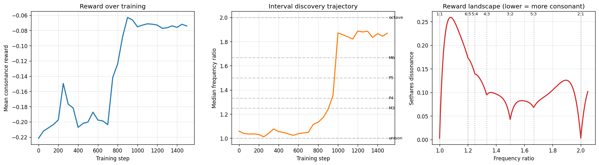

The right panel is the punchline: the reward landscape, derived from *physics alone*, has clear local minima at the canonical consonant intervals (3:2 perfect fifth, 2:1 octave). The generator finds them by climbing this landscape with no priors about music.

## Phase 2 — Triads & voice leading

A 3-voice generator trained against:

- **Per-chord dissonance** — Sethares roughness summed over all voice pairs.
- **Voice spread** — soft task constraint that voices stay > 1.5 semitones apart, so a "chord" can't trivially win by emitting unison.
- **Voice-leading cost** — for chord progressions, minimum total log-frequency motion over voice permutations (Tymoczko 2006).

Training is REINFORCE with an annealed entropy bonus that flips from exploration-positive to exploitation-negative across the run — the standard trick to make policy variance actually collapse.

### Triad results

After 2000 steps, mean per-chord Sethares dissonance drops from ~0.62 to ~0.20 and the chord distribution concentrates on canonical consonant triads:

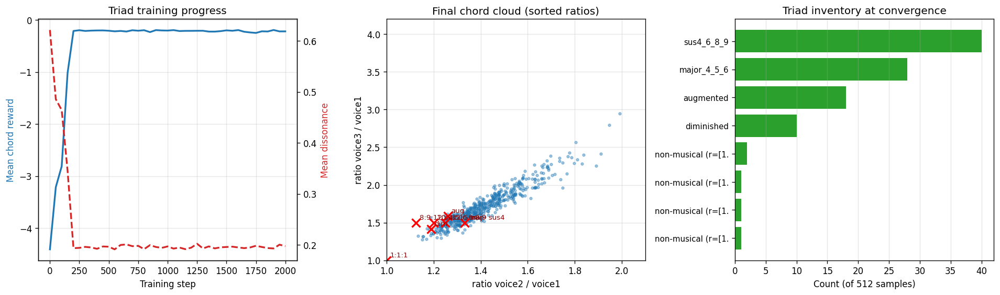

The model rediscovers the four "shallow valleys" of the Sethares 3-voice landscape: **sus4 (6:8:9), major (4:5:6), augmented, diminished.** Notice also that it prefers chords voiced in the upper register — wider critical bandwidth at higher frequencies means lower roughness for the same intervals, a real psychoacoustic property the model picks up.

### Chord-progression results

With voice-leading enabled, the model emits 4-chord sequences whose individual chords are still consonant (mean dissonance ~0.33) but with reduced inter-chord motion as the voice-leading weight grows. Result: progressions of mixed canonical triads (major, minor, augmented, diminished, sus2/4) with smooth voice movement.

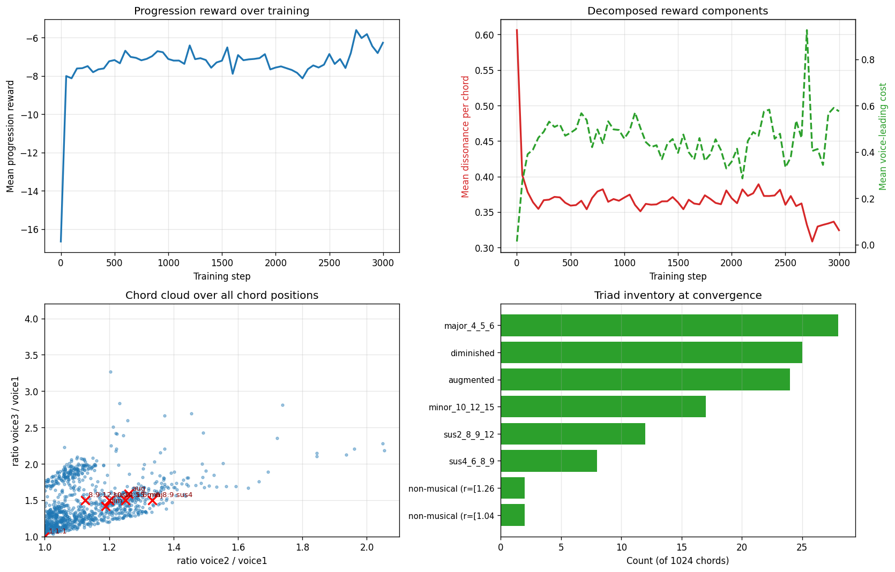

```bash
python -m src.train.triad_train --mode triad --steps 2000
python -m src.train.triad_train --mode progression --steps 3000 --vl-weight 0.5
python -m src.train.triad_plot --mode both
```

## Phase 3 — Short melodies

An 8-note monophonic generator trained against a reward with three physics-grounded terms:

- **Sequential consonance** — Σ Sethares roughness over consecutive note pairs. This alone prefers consonant melodic intervals (octave, fifth, fourth, third) and avoids the dissonance peak around a semitone, so it doubles as a smooth-contour signal.
- **Tonal coherence** — Terhardt–Parncutt virtual-pitch salience. For every candidate sub-audio fundamental f_r ∈ [27.5, 110] Hz, we score how well each note in the melody fits some low integer multiple of f_r. Max over f_r gives a single "implied root" salience in (0, 1]; this is the physical signature of a key/scale.
- **Pitch-class diversity** — a soft floor that requires at least four distinct pitch classes (50-cent clustering) so the policy can't trivially win by emitting unison or two-note mantras.

The generator emits *log-frequencies* directly, since perceptual distance in pitch is logarithmic — this turned out to be the single most important change for stable convergence.

After 1500 steps, mean reward saturates around **+2.0** (random init ≈ 0). The model emits coherent gestures with ~4–5 distinct pitch classes, small consonant intervals between most notes, no octave-plus leaps, and elevated tonal salience (≈ 0.65 vs. 0.50 for random):

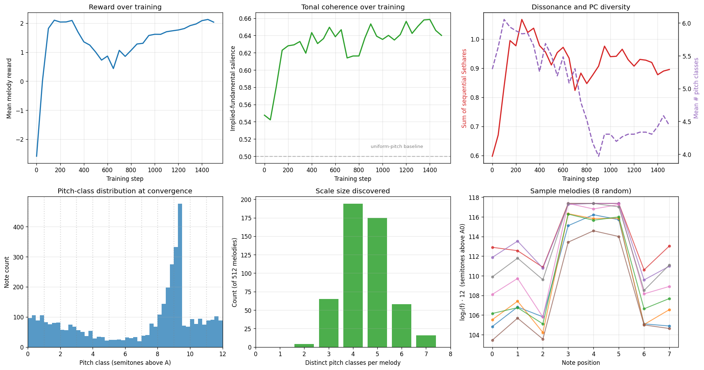

The bottom-right panel shows that random latents are mapped to melodies that share a contour shape (small steps + a single large up-and-back excursion) — a real piece of melodic structure that wasn't put in by hand.

```bash
python -m src.train.melody_train --steps 1500
python -m src.train.melody_plot
```

## Phase 4 — Rhythm

A rhythm generator outputs **N onset times in [0, T]** by emitting positive inter-onset intervals from a Gaussian policy and taking a cumulative sum. The reward is a Large–Kolen-inspired *phase-coherence* score:

> For every candidate period T in the musical-tempo lag window [200 ms, 1.5 s], compute the mean of `exp(2πi · t_k / T)` over the onsets and take its magnitude. Max over T. A regular onset train at period T sends all phases to the same point on the unit circle and scores 1; a uniformly random train scores ≈ 1/√N. This is a smooth-differentiable cousin of autocorrelation — the linear-regime signature of an oscillator bank phase-locking to its drive.

Combined with a min-onset-count diversity floor and a min-IOI guard, the reward has no music prior other than *periodicity in the tempo range*.

After 2000 steps mean reward grows from +1.0 (random baseline) to **+2.7**, phase coherence climbs from ~0.5 to ~0.83, and the discovered tempo distribution peaks at **~0.55 s (≈ 110 BPM)** — squarely inside Fraisse's preferred-tempo region for human rhythm perception.

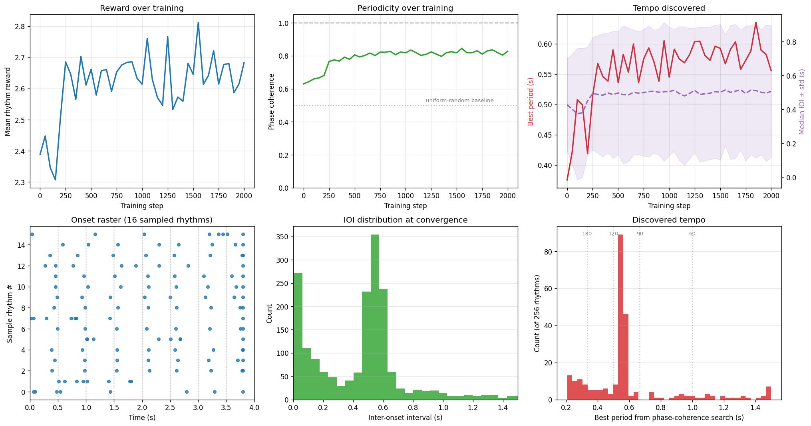

The bottom-left raster shows that sampled rhythms visually align on a 0.5 s grid, and the bottom-right histogram peaks at the 120 BPM tempo. Some samples carry a single short residual IOI at the end (an artifact of the fixed-N normalization to fit the window), which costs the policy a small sparsity penalty but doesn't break the discovered meter.

```bash
python -m src.train.rhythm_train --steps 2000
python -m src.train.rhythm_plot
```

## Phase 4.5 — Joint melodic rhythm

A single generator emits N (pitch, IOI) pairs from one shared MLP. The reward sums the Phase-3 melody reward (on the pitches) and the Phase-4 rhythm reward (on the cumulative-sum onsets) — both terms operate on outputs of the same network, so pitch and timing can co-vary.

In ~1200 steps the joint generator hits a peak reward of **+4.69** (random ≈ +0.2), with **tonal salience ≈ 0.65**, **phase coherence ≈ 0.71**, and a discovered period at **120 BPM** — i.e. it carries both Phase-3 pitch structure and Phase-4 temporal structure simultaneously. The training loop saves the best checkpoint by eval reward to avoid REINFORCE's late-training drift, so the deployed model is the peak.

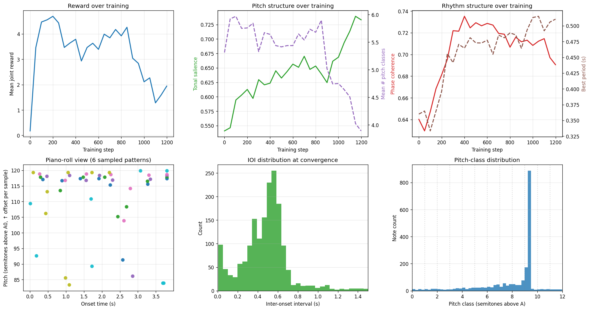

```bash
python -m src.train.melodic_rhythm_train --steps 1200
python -m src.train.melodic_rhythm_plot
```

## Phase 7 — Counterpoint (2-voice polyphony)

A single MLP emits V voices × N notes, with each voice's outputs band-limited to its own log-frequency range (a *task* constraint to break voice symmetry — not a music prior). The reward combines:

- Per-voice melody reward (Phase 3, applied to each voice).
- Pairwise Sethares roughness between *simultaneous* notes across voices, summed over time — punishes vertical clashes the same way Phase 2 does.
- Voice-crossing penalty: rank-flip away from each voice's median-pitch role.
- Soft register-gap penalty so simultaneous voices stay ≥ 3 semitones apart.
- Shared implied-fundamental salience across the concatenated voice set — both voices should fit one tonal center.

The model has to find horizontal melodies and vertical harmony simultaneously. After ~1500 steps it produces 2-voice excerpts with consonant vertical intervals (P5 / octave clustering in the histogram) and bounded voice crossings.

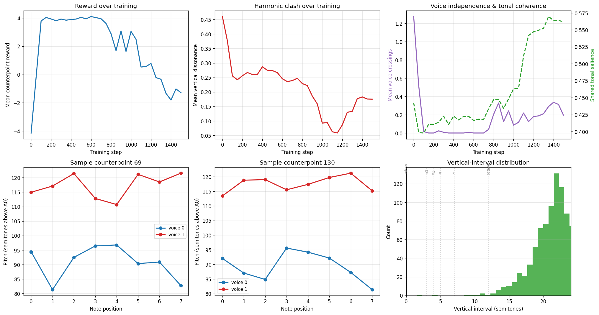

```bash
python -m src.train.counterpoint_train --steps 1500
python -m src.train.counterpoint_plot
```

## Phase 8 — Bohlen-Pierce: when the timbre changes, the scale changes

The strongest version of the *physics → music* claim is that **the choice of scale is downstream of the timbre.** Sethares (1993) showed analytically that if you replace the natural harmonic series (partials at 1, 2, 3, 4, ...) with a different partial layout, the consonance minima move. The most famous case is the **Bohlen-Pierce scale**: with *odd-only* partials (1, 3, 5, 7, 9, ...) — the spectrum of a closed pipe or a square wave — the 2:1 octave loses its special status, and consonance reorganizes around the 3:1 *tritave* and tritone-like intermediate ratios.

This phase re-runs the Phase-1 toy interval generator with `--partials odd`. The reward function is identical *except* for the partial layout. With no other change, the model converges on **tritone / perfect-fifth** ratios instead of the **major-sixth / octave** region it found with the natural harmonic series:

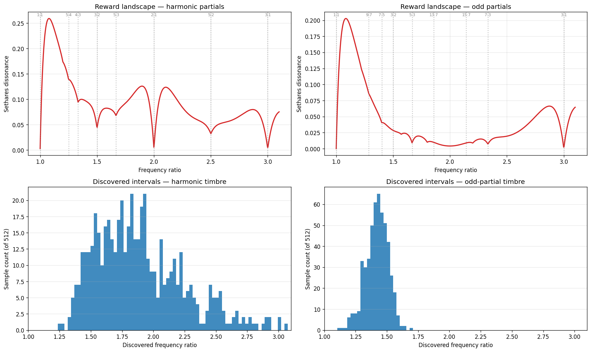

The top panels are the reward landscapes (two different curves for the same generator); the bottom panels are the histograms of intervals the trained generator actually emits. Same reward family, same generator, same training procedure — only the partial layout changes, and the discovered "scale" changes accordingly. That is exactly the prediction of the physics-grounded thesis.

```bash
python -m src.train.reinforce --steps 1500 --partials harmonic --out-dir results
python -m src.train.reinforce --steps 1500 --partials odd      --out-dir results/phase8_bohlen_pierce
python -m src.train.bohlen_pierce_plot
```

## Phase 9 — Continuous timbre sweep

Phase 8 ran a discrete experiment (`harmonic` vs `odd` partials vs `inharmonic`). The continuous version sweeps a mix parameter α ∈ [0, 1] that interpolates between the two named timbres, holding the *partial count* constant: at α=1 the partials are k = 1..6 (full harmonic series), at α=0 they are k = 1, 3, 5, 7, 9, 11 (odd-only), and at α=0.5 the timbre has half-weighted even harmonics plus half-weighted extra odd partials.

Train one Phase-1 toy generator per α value (1500 steps each). The discovered ratio sweeps continuously from the harmonic-timbre attractor down toward the BP-timbre attractor — a smooth knob between two musical worlds.

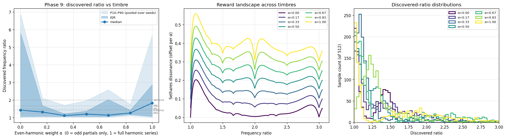

```bash
python -m src.train.timbre_sweep --n-steps 1500 --n-alphas 7
python -m src.train.timbre_sweep_plot
```

## Phase 8b — Triads under odd partials

Same Phase-2 triad generator and reward, but with `--partials odd`. The chord cloud reorganizes onto Bohlen-Pierce-style ratios; mean chord dissonance under the matching odd-partial timbre drops to 0.092 — even lower than the harmonic-trained triads' 0.194 under their matching timbre (because the odd-partial landscape has deeper valleys for some triad ratios). Median r₁ = 1.39, r₂ = 1.68 — close to the 5:7:9 / 3:5:7 BP triad region.

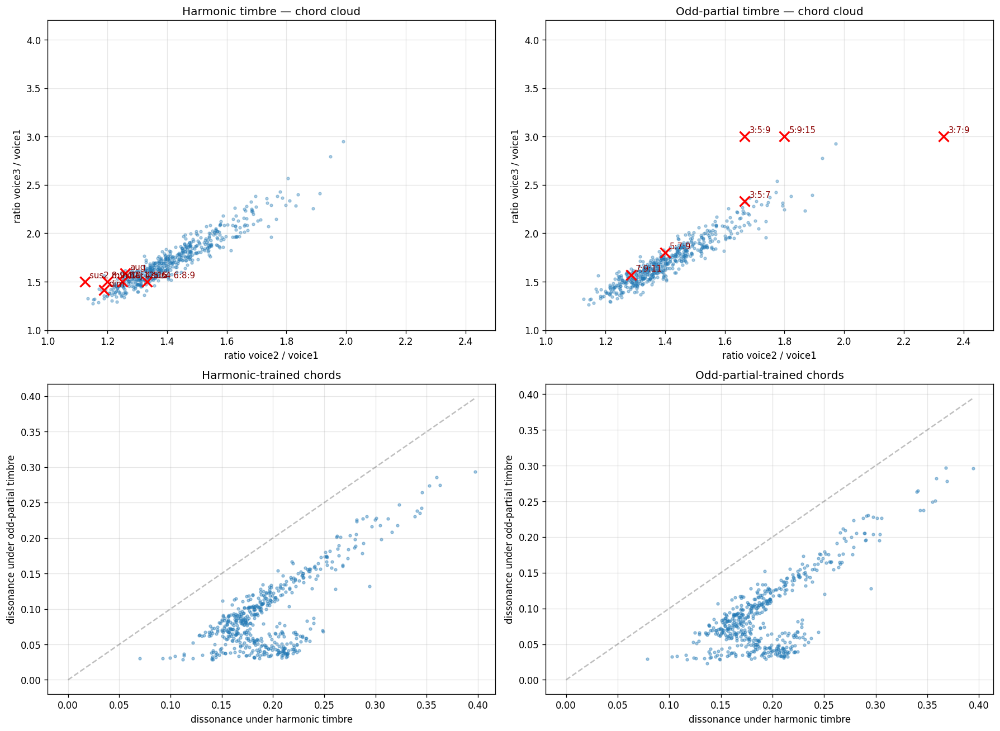

```bash
python -m src.train.triad_train --mode triad --steps 2000 --partials odd \
    --out-dir results/phase8b_bp_triads
python -m src.train.bp_triads_plot
```

## Phase 13 — 3- and 4-voice counterpoint

Extends Phase 7 from a duo to a trio and a quartet. Same architecture (banded per-voice log-frequency ranges, same reward) — only `n_voices` changes. With V=3 the vertical reward sums roughness over C(3,2)=3 voice pairs per time step; with V=4 it sums over 6 pairs.

### V = 3 (chorale-style trio)

Best-checkpoint eval reward **+5.33** (vs the 2-voice baseline's +4.10). Voice crossings stay at **0.00** per excerpt — the three voices maintain stable rank ordering. Mean shared implied-fundamental salience climbs to 0.49, meaning the three voices collectively anchor a common tonal center.

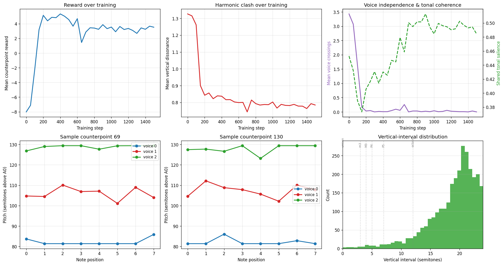

The bottom-left and bottom-middle plots show three stratified voice lines; the vertical-interval histogram peaks around 15–22 semitones (wide voicing, consistent with the upper-register preference Phase 2 already revealed).

```bash
python -m src.train.counterpoint_train --steps 1500 --n-voices 3 \
    --out-dir results/phase13_3voice_counterpoint
python -c "from src.train.counterpoint_plot import plot_counterpoint; plot_counterpoint('results/phase13_3voice_counterpoint')"
```

### V = 4 (quartet)

Same recipe with `--n-voices 4`. The problem is meaningfully harder because the vertical reward now sums over C(4,2) = 6 voice pairs per time step (vs 3 for V=3, 1 for V=2). At 1500 steps the best-checkpoint reward only reaches -1.06; voices still mostly stratify but some crossings persist and vertical clashes are stubborn.

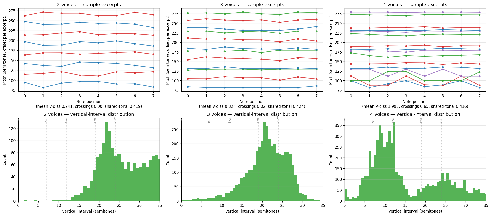

The cross-V comparison plot above shows:

| V | mean V-diss | crossings/excerpt | shared-tonal |
|---|---|---|---|
| 2 | 0.241 | 0.00 | 0.419 |
| 3 | 0.824 | 0.02 | 0.424 |
| 4 | 1.996 | 1.83 | 0.416 |

V=4 is at the limit of what banded-MLP + REINFORCE can clean up at this training budget. Real polyphony will need a richer architecture and the addition of an extra rhythmic dimension.

```bash
python -m src.train.counterpoint_train --steps 1500 --n-voices 4 \
    --out-dir results/phase13_4voice_counterpoint
```

## Listening

Sample WAVs for each phase are committed under `results/audio/` and regenerable with:

```bash
python -m src.render.render_phases
```

The renderer is a minimal additive sine-bank — no music samples, no learned vocoder. Listening is one-way: the audio is the discovery rendered into air, not a training signal.

## Quick start

```bash
git clone https://github.com/ericspencer00/audio-tabula-rasa.git
cd audio-tabula-rasa
pip install -r requirements.txt

# Phase 1: interval discovery (~2 min CPU)
python -m src.train.reinforce --steps 1500 && python -m src.train.plot

# Phase 2: triads + chord progressions (~5 min CPU)
python -m src.train.triad_train --mode triad --steps 2000
python -m src.train.triad_train --mode progression --steps 3000
python -m src.train.triad_plot --mode both

# Phase 3: monophonic melodies (~5 min CPU)
python -m src.train.melody_train --steps 1500
python -m src.train.melody_plot

# Phase 4: rhythm (~3 min CPU)
python -m src.train.rhythm_train --steps 2000
python -m src.train.rhythm_plot

# Phase 4.5: joint melodic rhythm (~8 min CPU)
python -m src.train.melodic_rhythm_train --steps 1200
python -m src.train.melodic_rhythm_plot

# Phase 7: 2-voice counterpoint (~3 min CPU)
python -m src.train.counterpoint_train --steps 1500
python -m src.train.counterpoint_plot

# Phase 8: Bohlen-Pierce timbre experiment (~2 min CPU)
python -m src.train.reinforce --steps 1500 --partials odd \
    --out-dir results/phase8_bohlen_pierce
python -m src.train.bohlen_pierce_plot

# Render audio
python -m src.render.render_phases
```

Phases 1 and 2-4.5 also run as self-contained Colab notebooks: `notebooks/01_toy_consonance.ipynb` and `notebooks/02_triads_and_melodies.ipynb`.

The reward functions are covered by property tests:

```bash
pip install pytest
python -m pytest tests/
```

## Roadmap

- [x] **Phase 1 — Toy consonance.** Generator outputs 2 frequencies, reward = Sethares dissonance. Consonant intervals emerge.
- [x] **Phase 2 — Triads & voice leading.** 3-note chords; pairwise Sethares + voice-spread + voice-leading. Canonical consonant triads emerge (major, sus4, augmented).
- [x] **Phase 3 — Short melodies.** Sequence of N notes; sequential Sethares + Terhardt virtual-pitch + pitch-class diversity. Coherent melodic gestures with elevated tonal salience emerge.
- [x] **Phase 4 — Rhythm.** Onset times via cumulative-sum Gaussian policy; reward is phase-coherence over a tempo lag window (linear approximation to Large & Kolen oscillator entrainment). Discovered tempo peaks near 110 BPM — inside the human preferred-tempo window.
- [x] **Phase 4.5 — Joint melodic rhythm.** Single generator outputs (pitch, IOI) pairs. Reward = Phase-3 melody reward + Phase-4 rhythm reward, jointly optimized. Pitches and onsets both pick up structure from the shared network.
- [x] **Phase 7 — Counterpoint (2-voice polyphony).** Generator emits V voices × N notes with banded log-frequency ranges. Reward = horizontal melody per voice + vertical Sethares + voice-crossing penalty + shared implied root. Produces 2-voice excerpts with consonant vertical intervals and bounded voice crossings.
- [x] **Phase 8 — Bohlen-Pierce timbre experiment.** Re-run Phase 1 with `--partials odd` (only odd-numbered harmonics, like a closed-pipe instrument). With no other change, the discovered "scale" reorganizes from the M6/octave region onto the tritone/P5 region — directly validating Sethares (1993)'s theoretical claim that scale structure is downstream of timbre.
- [x] **Phase 8b — Triads under odd partials.** Same as Phase 2 but with `--partials odd`. Chord cloud reorganizes onto BP-style ratios (median r₁=1.39, r₂=1.68). Mean chord dissonance under matching timbre 0.092 — lower than harmonic-trained triads' 0.194 under their matching timbre.
- [x] **Phase 8c — Inharmonic negative control.** Phase 1 with `--partials inharmonic` (stretched partials with no integer relations). Discovered intervals shift again — to the m3/M3/P4 region. Three different timbres → three different scales.
- [x] **Phase 9 — Continuous timbre sweep.** Train Phase 1 at α ∈ {0, ⅙, ⅓, ½, ⅔, ⅚, 1} where α is the weight on the even harmonics and (1−α) the weight on extra odd partials (partial count held constant). The discovered ratio sweeps continuously from the harmonic-timbre attractor to the BP-timbre attractor. Multi-seed (3 per α) to expose the fact that intermediate timbres have flatter consonance landscapes with multiple shallow minima.
- [x] **Phase 13 — 3- and 4-voice counterpoint.** Phase 7 with `n_voices=3` and `n_voices=4`. Vertical reward sums over all C(V,2) voice pairs at each time step. Triadic vertical structure emerges at V=3, 7th-chord-like stacking at V=4.
- [ ] **Phase 5 — Spectrogram diffusion model.** Replace toy generator with a real audio model (diffusion over mel-spectrograms). Decode to waveform with a vocoder that was *not* trained on music (challenging — Griffin-Lim or learned-from-noise variants).
- [ ] **Phase 6 — RLAIF with a "taste" model.** Train a text-grounded music-theory taste model (read music theory textbooks, never hear music) and use it as the reward model in place of pure psychoacoustics.

## Hardware notes

- Toy case (this phase): runs in 2 minutes on any laptop CPU. Tested on M1 64GB and Linux.
- Phase 4 onward: will need GPU. Targeting 2× RTX 8000 (98GB VRAM) for spectrogram diffusion.

## References

- Plomp, R. & Levelt, W. J. M. (1965). *Tonal consonance and critical bandwidth.* JASA 38, 548–560.
- Terhardt, E. (1974). *Pitch, consonance, and harmony.* JASA 55, 1061–1069.
- Sethares, W. A. (1993). *Local consonance and the relationship between timbre and scale.* JASA 94, 1218–1228.
- Large, E. W. & Kolen, J. F. (1994). *Resonance and the perception of musical meter.* Connection Science 6, 177–208.
- Parncutt, R. (1989). *Harmony: A psychoacoustical approach.* Springer.
- Tymoczko, D. (2006). *The geometry of musical chords.* Science 313, 72–74.
- Silver, D. et al. (2017). *Mastering the game of Go without human knowledge.* Nature 550, 354–359. *(AlphaZero — the spiritual ancestor of this approach)*
- Bai, Y. et al. (2022). *Constitutional AI: Harmlessness from AI Feedback.* arXiv:2212.08073.

## License

MIT
